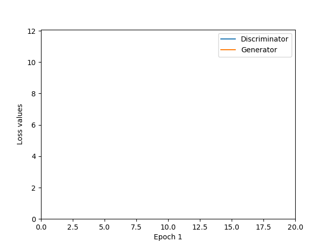
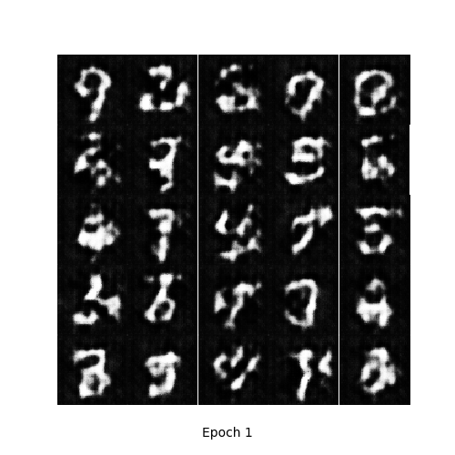

# DCGAN
PyTorch implementation of Deep Convolutional Generative Adversarial Networks (DCGAN)

## Generating MNIST dataset
### Network architecture
* Input data
    * MNIST data is resized to 64x64 size images
* Generator
    * hidden layers: Four 4x4 strided convolutional layers (1024, 512, 256, and 128 kernels, respectively) with ReLU
    * output layer: 4x4 strided convolutional layer (1024 nodes = 64x64 size image) with Tanh
    * Batch normalization is used except for output layer

* Discriminator
    * hidden layers: Four 4x4 convolutional layers (128, 256, 512, and 1024 kernels, respectively) with Leaky ReLU
    * output layer: 4x4 convolutional layer (1 node) with Sigmoid
    * Batch normalization is used except for 1st hidden layer & output layer
    
### Results
* For learning rate = 0.0002 (Adam optimizer), batch size = 128, # of epochs = 20:
<table align='center'>
<tr align='center'>
<td> GAN losses</td>
<td> Generated images</td>
</tr>
<tr>
<td>
<td>
</tr>
</table>

### References
1. https://github.com/znxlwm/pytorch-MNIST-CelebA-GAN-DCGAN
2. https://github.com/moono/moo-dl-practice/tree/master/Work-place/DCGAN-MNIST
3. https://github.com/yunjey/pytorch-tutorial/blob/master/tutorials/03-advanced/deep_convolutional_gan

